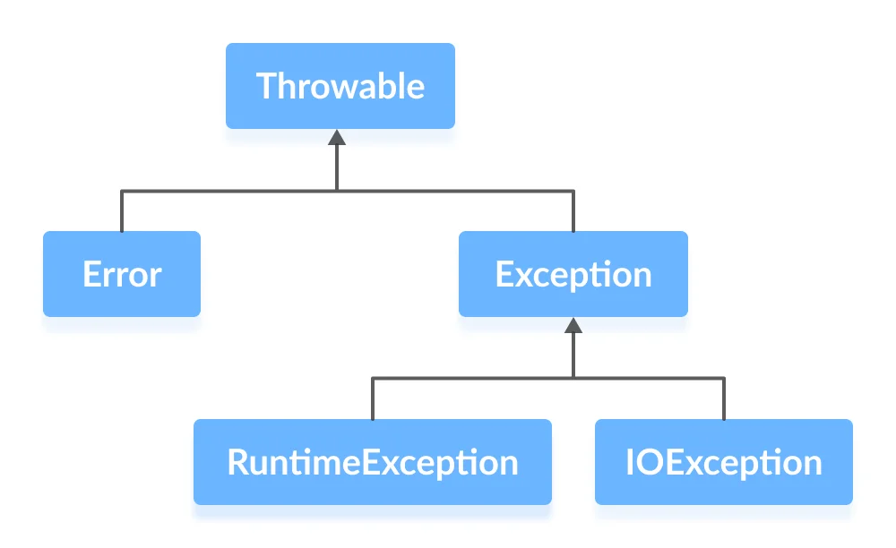

# Java Exceptions

An exception is an unexpected event that occurs during program execution. It affects the flow of the program instructions which can cause the program to terminate abnormally.

## Some common reasons for exceptions are:
- Trying to access a file that does not exist
- Trying to divide a number by zero
- Trying to access an array element that does not exist
- Trying to access an object that is null
- Trying to access a network resource that is not available
- Trying to access a database that is not available
- Trying to access a resource that is not available

## Java Exception Hierarchy


## Error vs Exception
- **Error**: Errors are exceptional scenarios that are out of the scope of application and it's not possible to anticipate and recover from them. For example, hardware failure, JVM crash or out of memory error. That's why they are unchecked exceptions.
- **Exception**: Exceptions are events that can occur during the execution of a program that disrupts the normal flow of instructions. It is possible to anticipate and recover from them. For example, FileNotFoundException, SQLException, etc. That's why they are checked exceptions.
- **Throwable**: Throwable is the superclass of all errors and exceptions in the Java language. Only objects that are instances of this class (or one of its subclasses) are thrown by the Java Virtual Machine or can be thrown by the Java throw statement.

## Types of Exceptions
- **Checked Exceptions [IOException]**: These are the exceptions that are checked at compile time. If some code within a method throws a checked exception, then the method must either handle the exception or it must specify the exception using throws keyword.


- **Unchecked Exceptions [RuntimeException]**: These are the exceptions that are not checked at compile time. It is up to the programmer to be judicious in handling these exceptions. If an unchecked exception occurs in the method, the method does not need to specify that it can throw the exception using throws keyword.


## Exception Handling
- **try**: The try block contains a set of statements that might throw an exception. If an exception occurs within the try block, it is thrown. The try block must be followed by either catch or finally block or both.
- **catch**: A catch block is where you handle the exception. The catch block must be preceded by a try block. It can be followed by finally block later.
- **finally**: The finally block always executes when the try block exits. This ensures that the finally block is executed even if an unexpected exception occurs. It is used to release resources such as file streams, database connections, etc.

```java
try {
    // code that may throw an exception
} catch (Exception e) {
    // exception handling code
} finally {
    // cleanup code
}
```

## Throw and Throws
- **throw**: The throw keyword is used to explicitly throw an exception. It is used to throw a custom exception or a built-in exception.
- **throws**: The throws keyword is used to declare an exception. It gives an indication to the caller of a method that the method might throw an exception.

```java
void method() throws IOException {
    // code that may throw an exception
}
```

## Custom Exception
You can create your own exceptions in Java. These exceptions are known as custom exceptions. You can create your own exception class by extending the Exception class.

```java
class MyException
{
    public static void main(String args[])
    {
        try
        {
            throw new MyException();
        }
        catch(MyException e)
        {
            System.out.println("Caught");
        }
    }
}
```