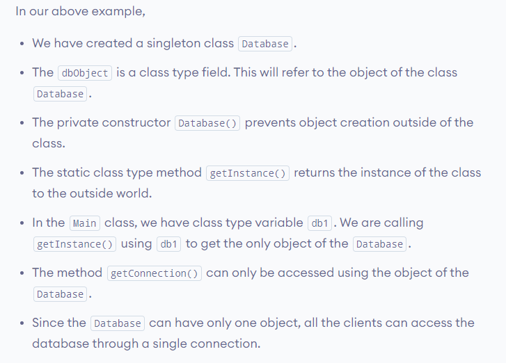

# Java Singleton Class
 Singleton is a design pattern that ensures that a class can only have one object.

To create a singleton class, a class must implement the following properties:

- Create a <b> private</b> constructor of the class to restrict object creation outside of the class.
- Create a <b>private</b> attribute of the class type that refers to the single object.
- Create a <b>public static</b> method that allows us to create and access the object we created. Inside the method, we will create a condition that restricts us from creating more than one object.

<h4>Example: Java Singleton Class Syntax<h4>

```java 
class SingletonExample {

   // private field that refers to the object
   private static SingletonExample singleObject;
                                              
   private SingletonExample() {
      // constructor of the SingletonExample class
   }

   public static SingletonExample getInstance() {
      // write code that allows us to create only one object
      // access the object as per our need
   }
}
```


<h3>Use of Singleton in Java </h3>
Singletons can be used while working with databases. They can be used to create a connection pool to access the database while reusing the same connection for all the clients. For example,

```java
class Database {
   private static Database dbObject;

   private Database() {      
   }

   public static Database getInstance() {

      // create object if it's not already created
      if(dbObject == null) {
         dbObject = new Database();
      }

       // returns the singleton object
       return dbObject;
   }

   public void getConnection() {
       System.out.println("You are now connected to the database.");
   }
}

class Main {
   public static void main(String[] args) {
      Database db1;

      // refers to the only object of Database
      db1= Database.getInstance();
      
      db1.getConnection();
   }
}


```


> Singleton is a design pattern rather than a feature specific to Java. A design pattern is like our code library that includes various coding techniques shared by programmers around the world.
